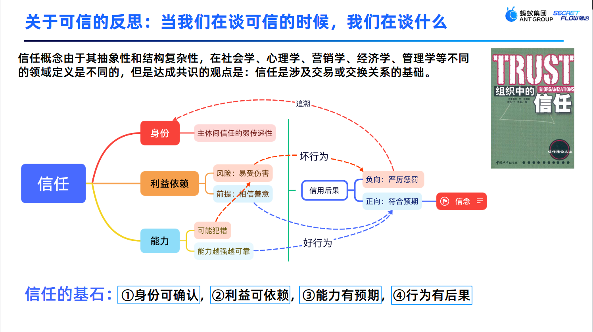

# ⚙️Secretflow_openNotebook && Lesson_1⚙️

## 🎮数据可信流通体系🎮

### ⚙️不可信风险⚙️

数字化时代，数据已经成为企业和个人的重要资产，数据流通也变得越来越频繁。然而，随着数据流通的增加，不可信风险也在不断升高。这些风险不仅会导致个人隐私泄露，还会对企业和社会带来巨大的损失。

在数据流通过程中，可信链条的级联失效是一个严重的问题。一旦链条中的任何一个环节出现问题，就可能导致整个体系崩塌。例如，2023 年 2 月，万国数据和新加坡的数据中心遭遇黑客攻击，客户登录信息被泄露。这个事件显示，即使是大型数据中心也无法完全避免黑客攻击的风险。另一个例子是美国科技公司 Ubiquiti 在 2021 年 1 月曝出的数据泄露事件，该公司的员工监守自盗，导致市值损失数亿美元。这个案例表明，内部人员也可能成为数据流通中的不可信风险来源。

除了黑客攻击和内部人员出卖数据之外，数据滥用也是一个严重的不可信风险。例如，剑桥分析公司未按约定使用从 Facebook 获得的 8000 万用户数据，擅自将数据用于政治广告分析，导致脸书公司遭受 50 亿美元的罚款。这个事件显示，数据的滥用不仅会导致个人隐私的泄露，还会对社会产生负面影响。

数据流通的外循环对于传统数据安全的全新挑战。在数据离开持有方安全域后，信任基石遭到破坏，责任主体不清，利益诉求不一致，能力参差不齐，责任链路难追溯。因此，需要建立数据可信流通体系，从运维信任走向技术信任，解决信任级联失效，确保数据流通过程可追溯、安全风险可防范。

数据可信流通体系需要全新的技术要求标准与技术方法体系。例如，可以使用区块链技术来实现数据的去中心化存储和可信流转，使用加密技术来保护数据的安全性和隐私性，使用智能合约来实现数据交易的自动化和可信执行。同时，也需要建立完善的数据全流程合规与监管规则体系，建立数据流通准入标准规则，强化市场主体数据全流程合规治理，确保流通数据来源合法、隐私保护到位、流通和交易规范。

如果将以上情况总结表述 -> 数据可信流通体系对于实现数据安全、隐私保护和可信交易具有重要意义。在建设数据可信流通体系的过程中，需要全面考虑各种不可信风险，采取有效的技术手段和监管措施，确保数据流通过程可确认、使用范围可界定、流通过程可追溯、安全风险可防范。

### 🎮从运维信任走向技术信任🎮

### ⚙️数据可信流通的政策指导：数据二十条⚙️

数据二十条是建立数据可信流通体系的重要指导。通过数据二十条，我们能够建立合规高效、场内外结合的数据要素流通和交易制度是其中的关键内容。具体来说，需要建立数据来源可确认、使用范围可界定、流通过程可追溯、安全风险可防范的数据可信流通体系。在技术手段方面，可以采用密态计算、可信数字身份、密态胶囊等技术来保护数据的安全性和隐私性。同时，需要建立使用权、跨域管控、受控匿名化等机制，确保数据的使用范围可界定、流通可追溯。在数据交易过程中，需要实现全链路审计，保证数据的真实性、完整性和及时性。此外，需要采用分布式技术，建立密态枢纽、密态管道和计算节点等基础设施，实现数据的安全流通和计算。

## 🎮技术信任🎮

### ⚙️可信数字应用身份：证明你是你，从哲学走向技术⚙️

### 🎮使用权跨域管控：利益对齐的核心技术要求🎮

### ⚙️隐语可信隐私计算技术实践，开源共建全栈密态流转支撑能力⚙️

### 🎮全链路审计，闭环完整的数据可信流通体系🎮

