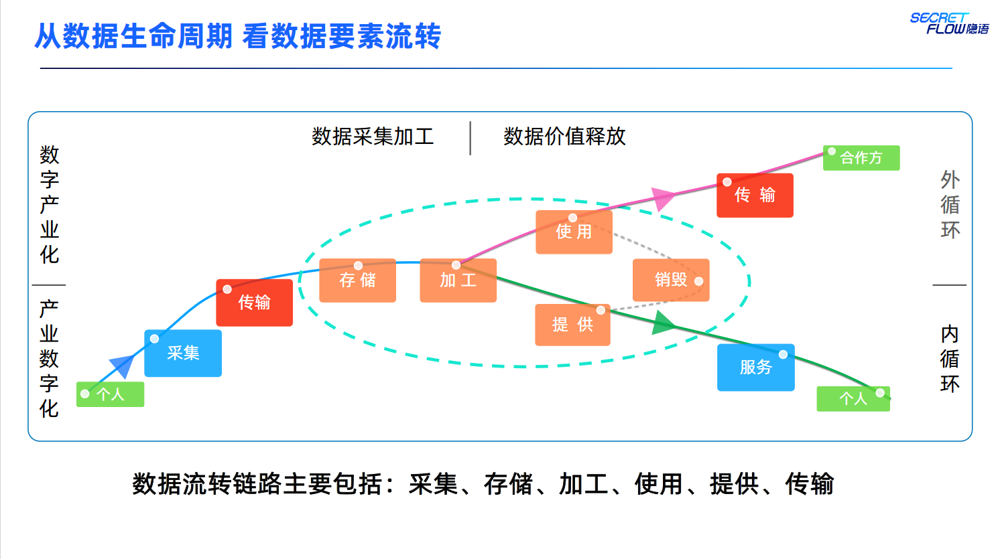
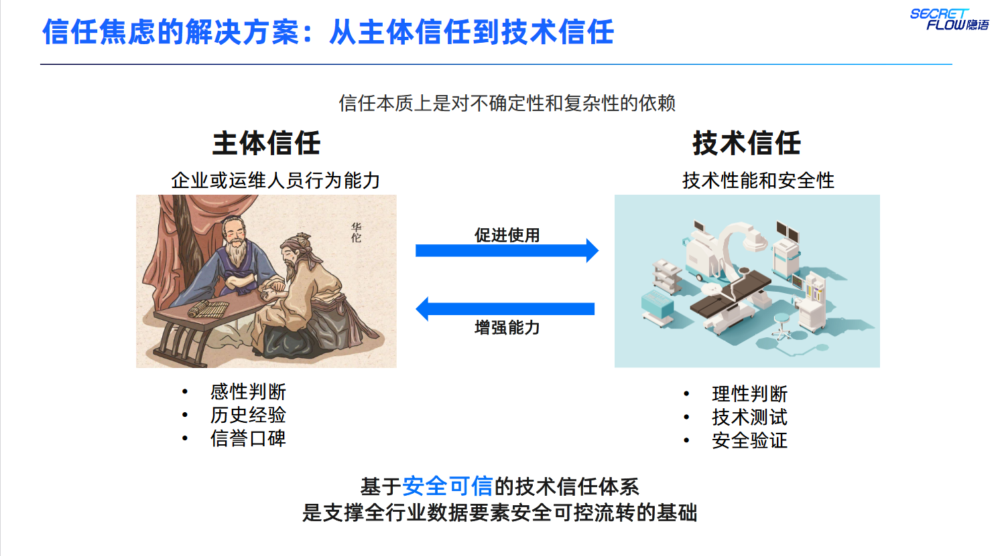
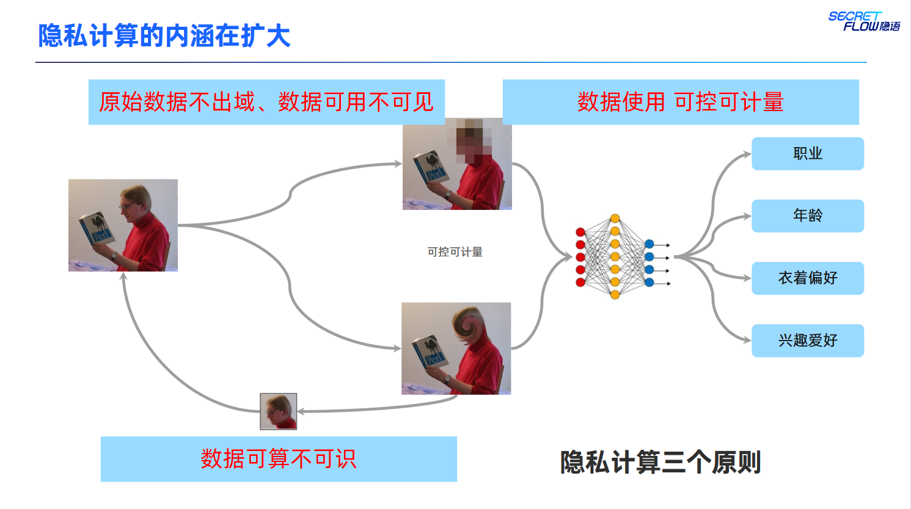
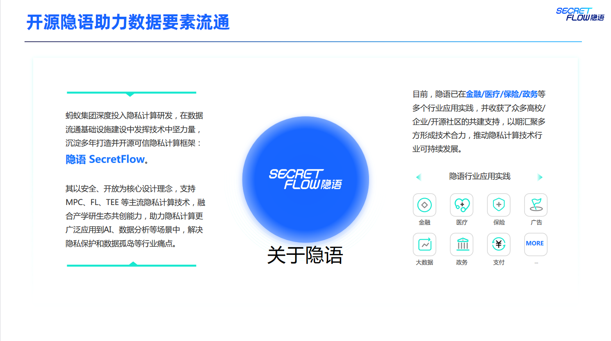
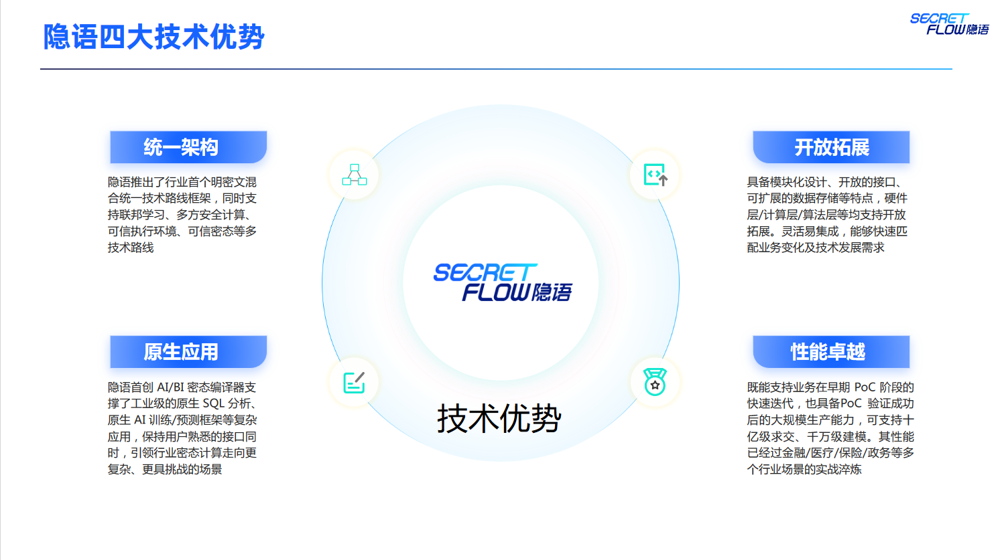
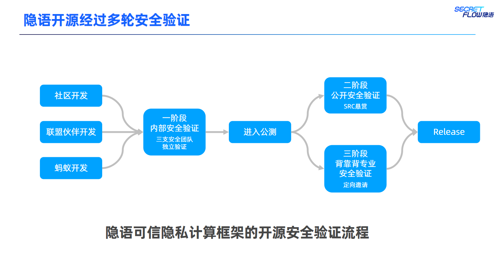

# ⚙️Secretflow_openNotebook && Lesson_2⚙️

## 🎮数据要素流转与数据内外循环🎮

### ⚙️数据内外循环⚙️

### 🎮信任焦虑🎮

在数据外循环中，信任焦虑是一个重要的问题。数据提供方和数据使用方在加入数据要素市场时，都会有各种各样的信任焦虑。例如，运维人员是否可信？使用方是否会按约定使用数据？数据来源是否合规？数据在流通过程中是否会被泄漏？支持流通的技术产品是否有安全风险？这些信任焦虑都会影响数据要素市场的发展。

在过去几年中，已经发生了许多代表性的数据安全事件，这些事件进一步增强了人们对数据安全的担忧。例如，2023年，美国科技公司Ubiquiti在2021年1月曝出数据泄露事件，事后发现该公司员工Sharp才是事后背后的始作俑者。英国剑桥分析公司未经用户同意的情况下，获取海量Facebook用户数据，并将这些数据用于政治广告分析，以支持2016年唐纳德·特朗普的总统竞选。美国网络影视公司Netflix举办了一个预测算法的比赛，比赛要求在公开数据上推测用户的电影评分，但UTAustin研究者关联IMDb互联网电影数据库后识别了其中的用户身份。这些事件都暴露了数据安全和隐私保护方面的问题。

### ⚙️从主体信任到技术信任⚙️

为了解决信任焦虑，需要从主体信任到技术信任，建立基于安全可信的技术信任体系，是支撑全行业数据要素安全可控流转的基础。在技术手段方面，可以采用隐私计算、区块链等技术来保护数据的安全性和隐私性。在机制措施方面，需要建立数据来源合规、数据安全保障、数据流转合规和数据流转安全等机制，确保数据的合规性和安全性。同时，需要建立数据确权机制，保护数据资源持有权、数据加工使用权和数据产品经营权，防止数据被滥用。在数据交易过程中，需要建立数据定价机制，保证数据交易的公正性和公平性。总之，需要采取多种技术手段和机制措施，确保数据外循环中的信任焦虑得到有效解决。

## 🎮数据要素流通对隐私计算的期望🎮

数据要素流通对隐私计算的期望包含了多个综合层面。**第一**，需要建立统一的安全评估标准，使得隐私计算产品的安全性能可以进行量化评估，从而更好地满足用户的需求。例如，XGB Benchmark 就是一种用于评估隐私计算产品安全性能的基准测试工具，它可以根据样本量、准确率、支持算法等因素将隐私计算产品分为五个级别，从而帮助用户更好地选择适合自己需求的产品。**其次**，需要降低隐私计算技术的接入门槛，使得更多企业和个人可以使用隐私计算技术。这需要通过标准化和开源等手段，促进数据要素流通中事实标准的发展，使得隐私计算技术更加普及和易用。**第三**，需要提高隐私计算技术的安全性和可靠性，使得它可以更好地保护数据安全。这需要不断探索和研发新的隐私计算技术，提高其对抗各种安全威胁的能力。同时，也需要不断优化现有隐私计算技术的性能，提高其处理大规模数据的能力。**最后**，需要扩展隐私计算技术的应用场景，使得它可以更好地满足不同行业的需求。例如，在金融、医疗、智能制造等领域中，都有大量的敏感数据需要进行安全计算和分析，这些场景都可以使用隐私计算技术来实现数据安全和隐私保护。

## ⚙️隐私计算开源助力数据要素流通⚙️

