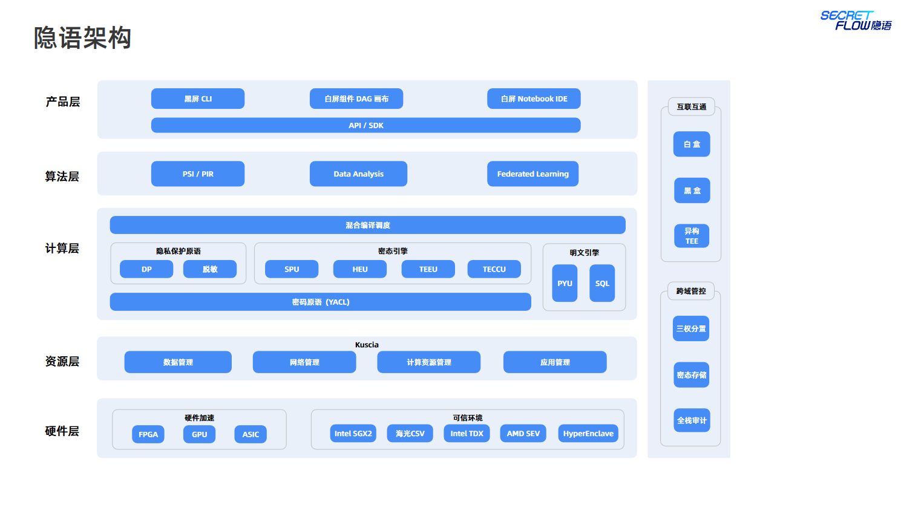
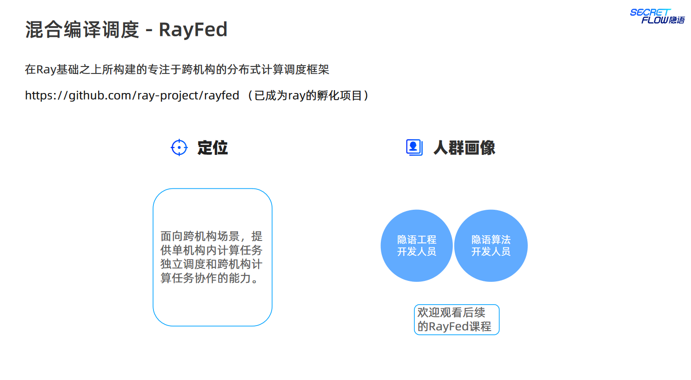

# ⚙️Secretflow_openNotebook && Lesson_3⚙️

## 🎮隐语架构概览🎮

### ⚙️隐语架构⚙️

### 🎮隐语产品🎮

隐语的架构分为硬件层、资源层、计算层、算法层和产品层，其中硬件层提供硬件加速和可信环境，如 Intel SGX、海光CSV、Intel TDX 等；资源层负责数据管理、网络管理、计算资源管理和应用管理；计算层提供密态引擎和明文引擎，支持密码原语、联邦学习、数据分析等计算任务；算法层提供各种隐私保护算法，如同态加密、可信执行环境、秘密共享等；产品层提供可视化界面、API/SDK 等接口，支持黑盒和白盒应用。

其应用场景包括但不限于人群画像、数据分析、联邦学习等。为了满足不同用户的需求，隐语提供了多种部署形态，如中心模式、P2P 模式、MPC 等；同时，隐语还支持轻量化安装和快速验证 POC，方便用户进行试用和评估。

作为隐私保护计算的重要组成部分，隐语不仅可以降低终端用户的体验和演示成本，还可以降低技术集成商的研发成本。同时，其还可以提供全栈审计、跨域管控等功能，满足用户对数据安全和隐私保护的需求。

### ⚙️PSI/PIR⚙️

PSI(Private Set Intersection) 和 PIR(Private Information Retrieval) 是隐私计算中两种重要的协议。PSI 是一种特殊的安全多方计算 (MPC) 协议，它允许两方或多方在不泄漏其他信息的情况下，计算出它们各自数据集的交集。PIR 则允许用户在不泄漏查询内容的情况下，从服务器端检索特定的数据。

PSI/PIR 协议在人群画像等场景中有广泛的应用。为了满足不同场景下的需求，需要开发高性能、轻量化、易用的 PSI/PIR 专用协议模块。SecretNote 是一种交互式建模工具，支持各类PSI/PIR协议，包括半诚实模型和恶意模型下的协议。它提供多层入口，支持协议优化和性能优化，以满足不同用户的需求。

PSI/PIR 协议的开发和应用需要涉及多方共同协作。需求人员需要根据具体业务场景，确定使用哪种协议和模型；产品人员需要负责产品的设计和开发，确保其易用性和可扩展性；研发人员则负责协议的实现和优化，确保其安全性和性能。SecretNote以库的形式提供 PSI/PIR 协议，开发人员可以通过 SecretFlow 接入 (Python) 或以库的形式集成到自己的应用中。同时，SecretNote 还计划提供产品层的支持，使得白屏用户也可以轻松使用 PSI/PIR 协议。

### 🎮Data Analysis - SCQL🎮

### ⚙️联邦学习⚙️

### 🎮混合编译调度 - RayFed🎮

### ⚙️Secure Process Unit⚙️

Secure Process Unit (SPU) 是一个安全计算框架，它桥接了上层算法和底层安全协议，为用户提供透明的、高性能的、基于安全协议的密态计算能力，同时保持原生 AI 框架体验。

SPU 包括编译器、运行时和执行器等组件。SPU 的前端支持原生接入主流 AI 前端，如 TensorFlow、JAX 和 PyTorch，并支持丰富的机器学习算法。SPU 还具有带有隐私保护语义的中间表示语言，基于 MLIR 进行加密计算编译优化。

SPU 支持各种 MPC 协议，包括 Semi2k、ABY3 和 Cheetah，并提供高性能的 MPC 协议虚拟机。它还支持数据并行和指令并行优化，以及丰富的 MPC 协议，适配各种场景。SPU 还支持协议扩展和异构设备接入。

SPU 面向编译器、机器学习和密码协议的研发人员。它为这些开发人员提供透明、高性能、安全的计算环境，使他们可以专注于自己的专长，同时确保计算的安全和隐私。

### 🎮Homomorphic Encryption Unit🎮

### ⚙️Trusted Enextution Environment Unit⚙️

### 🎮Yet Another Common Crypto Library🎮

### ⚙️KUbernetes based Secure Collaborative InfrA⚙️

